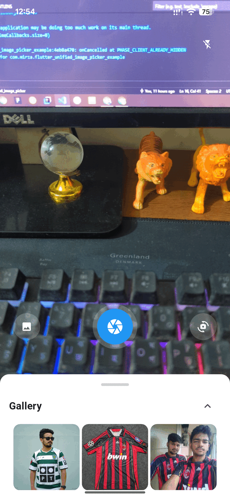

# 🖼️ flutter_unified_image_picker

[](https://pub.dev/packages/flutter_unified_image_picker)  [](https://flutter.dev) [](https://opensource.org/licenses/MIT)

A powerful Flutter plugin for **camera capture** and **gallery selection** with a draggable bottom sheet. Fully decoupled architecture using **CameraService**, **GalleryService**, and **BottomSheetService**, all managed by `ImagePickerController`.

---

## 🔥 Features

- 📸 Capture images from front/back/multiple cameras.  
- 🔄 Switch between available camera lenses.  
- ⚡ Toggle flash on/off.  
- 🖼️ Access gallery images in a draggable bottom sheet.
- 🎯 Production-ready and easy to integrate in any Flutter project.  

---

## 📷 Screenshots

| Camera Preview | Draggable Gallery |
|----------------|-----------------|
|| |

---

## Video demo

---

## Getting Started

### 💉 Installation

Add the dependency to your `pubspec.yaml`:

```yaml
dependencies:
  flutter_unified_image_picker:
    git:
      url: https://github.com/mirzamahmud/flutter_unified_image_picker.git
```

or

```yaml
dependencies:
  flutter_unified_image_picker: ^1.0.0
```

or

```bash
flutter pub add flutter_unified_image_picker
```

Then run

```bash
flutter pub get
```

---

### 📱 Android Setup

**1. Add permissions to android/app/src/main `AndroidManifest.xml`:**

```xml
<uses-permission android:name="android.permission.CAMERA" />
<uses-permission android:name="android.permission.READ_EXTERNAL_STORAGE" />
<uses-permission android:name="android.permission.WRITE_EXTERNAL_STORAGE" />
```

**2. For Android 13+:**

```xml
<uses-permission android:name="android.permission.READ_MEDIA_IMAGES" />
```

**3. Ensure minSdkVersion in android/app/build.gradle is at least 21.**

---

### 📱 iOS Setup

Add permissions to ios/Runner/Info.plist:

```xml
<key>NSCameraUsageDescription</key>
<string>We need access to your camera to take photos</string>
<key>NSPhotoLibraryUsageDescription</key>
<string>We need access to your photo library to select images</string>
```

---

### 🎯 Usage

```dart
import 'package:flutter/material.dart';
import 'package:flutter_unified_image_picker/src/controller/image_picker_controller.dart';
import 'package:flutter_unified_image_picker/src/views/camera_view.dart';

void main() => runApp(const MyApp());

class MyApp extends StatelessWidget {
  const MyApp({super.key});

  @override
  Widget build(BuildContext context) {
    return MaterialApp(
      home: const HomeScreen(),
    );
  }
}

class HomeScreen extends StatelessWidget {
  const HomeScreen({super.key});

  @override
  Widget build(BuildContext context) {
    return Scaffold(
      appBar: AppBar(title: const Text('Image Picker Pro Example')),
      body: Center(
        child: ElevatedButton(
          child: const Text('Open Camera'),
          onPressed: () async {
            final result = await Navigator.push(
              context,
              MaterialPageRoute(
                builder: (_) => CameraView(),
              ),
            );

            if (result != null) {
              print('Selected image path: $imagePath');
            }
          },
        ),
      ),
    );
  }
}
```

---

## 🛠️ Controller Overview

The `ImagePickerController` manages all functionalities:

| Service | Responsibilities |
|----------------|-----------------|
| **CameraService** | Camera preview, capture, lens switch, flash toggle |
| **GalleryService** | Loads images from the device gallery via platform channel |
| **BottomSheetService** | Draggable bottom sheet state and animations |

---

## 💡 Example

Check the [](https://github.com/mirzamahmud/flutter_unified_image_picker/blob/main/example/lib/main.dart) folder for a complete working demo with camera and gallery integration.

---

## 📄 License

This project is licensed under the MIT License.

---

## ❤️ Contribution

Contributions, bug reports, and feature requests are welcome!
